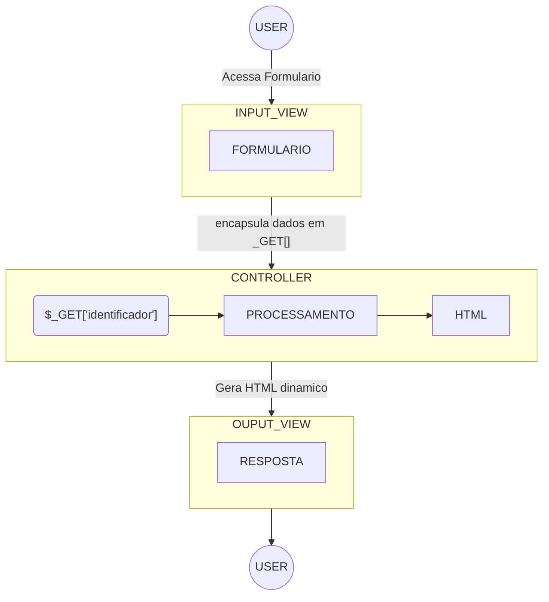

# Formularios

## 1. Criando um Formulário HTML

Para criar um formulário em PHP, você começa com um formulário HTML padrão. Por exemplo:

```html
<form action="processar_formulario.php" method="get">
    Nome: <input type="text" name="nome"><br>
    Email: <input type="email" name="email"><br>
    Mensagem: <textarea name="mensagem"></textarea><br>
    <input type="submit" value="Enviar">
</form>
``` 

Este formulário possui campos para nome, email e mensagem, e um botão de envio. O atributo action especifica para onde os dados do formulário serão enviados e o atributo method especifica como os dados serão enviados (neste caso, usando o método POST).

## 2. Processando os Dados do Formulário em PHP

Quando o formulário é enviado, os dados são enviados para o arquivo especificado no atributo action. No exemplo acima, os dados serão enviados para processar_formulario.php. Dentro desse arquivo PHP, você pode acessar os dados do formulário usando a superglobal $_POST. Por exemplo:

```php
$nome = $_POST['nome'];
$email = $_POST['email'];
$mensagem = $_POST['mensagem'];

echo "$nome, $email, $mensagem";
```

> Faça algo com os dados, como enviar um email, salvar no banco de dados, etc.

## 3. Retornando Feedback para o Usuário

Depois de processar os dados do formulário, é comum retornar feedback para o usuário. Isso pode ser feito exibindo mensagens de sucesso ou erro na mesma página ou redirecionando o usuário para uma página específica.


## 4. Resumo 

1. Observe que o usário acessa o formulário e faz o input de dados no formulário.
2. O formulário encapsula os dados na super global `$_GET`;
3. O formulário executa a `action` especificada, no caso um script em PHP.
4. Ao executar a `action`, o formulário faz a navegação para o `script` repassando os dados capturados no `$_GET`.
5. O `script` faz os processamentos necessários e gera uma visualização em `HTML` para o `usuario`.


