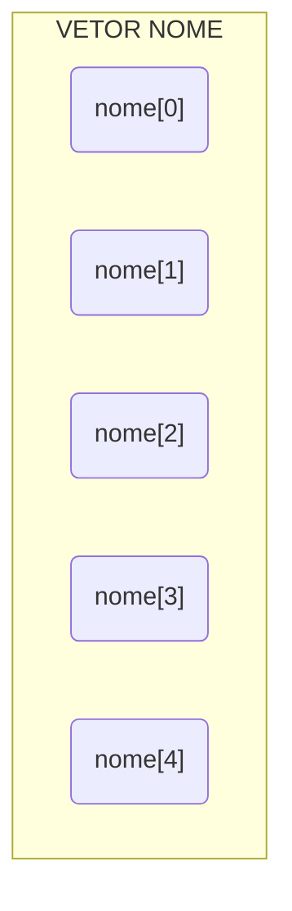

# Vetores em PHP

Vetores são coleções de variáveis que possume um único identificador (nome); cada uma das variáveis desta coleção são identificadas um índice numérico.

> Em PHP podemos utilizar indices textuais também.



Em memória teremos 5 variáveis nome, sendo elas:

```php
<?php
    // Declaração das varoáveis
    $nome[0];
    $nome[1];
    $nome[2];
    $nome[3];
    $nome[4];

    // Atribuição de valores
    $nome[0] = 'Andre';
    $nome[1] = 'David';
    $nome[2] = 'João';
    $nome[3] = 'Juliana';
    $nome[4] = 'Carla';

    // Exibir os dados do vetor
    echo "Na variavel nome[0] temos o valor $nome[0].\n";
    echo "Na variavel nome[1] temos o valor $nome[1].\n";
    echo "Na variavel nome[2] temos o valor $nome[2].\n";
    echo "Na variavel nome[3] temos o valor $nome[3].\n";
    echo "Na variavel nome[4] temos o valor $nome[4].\n";
?>
```

## Exemplos em PHP

### 1. Criar um Array de Contatos

```php
$contato1 = array(
    "nome" => "João",
    "email" => "joao@example.com",
    "telefone" => "123456789"
);


$contato2 = array(
    "nome" => "Maria",
    "email" => "maria@example.com",
    "telefone" => "987654321"
);
```

Neste exemplo, criamos dois arrays $contato1 e $contato2, cada um contendo informações sobre um contato.

### 2. Acessar os Elementos do Array

> Você pode acessar os elementos de um array usando chaves associativas:

```php
echo "Nome: " . $contato1["nome"] . "<br>";
echo "E-mail: " . $contato1["email"] . "<br>";
echo "Telefone: " . $contato1["telefone"] . "<br>";
``` 

> Isso exibirá as informações do $contato1 na tela.

### 3. Iterar sobre um Array

> Você pode usar um loop para iterar sobre todos os contatos em um array:

```php
$contatos = array($contato1, $contato2);

foreach ($contatos as $contato) {
    echo "Nome: " . $contato["nome"] . "<br>";
    echo "E-mail: " . $contato["email"] . "<br>";
    echo "Telefone: " . $contato["telefone"] . "<br><br>";
}
```

> Isso imprimirá as informações de todos os contatos na tela.

### 4. Adicionar ou Modificar Elementos

Você pode adicionar ou modificar elementos em um array conforme necessário:

```php
$contato1["cidade"] = "São Paulo";
$contato2["telefone"] = "555555555";

echo "Cidade: " . $contato1["cidade"] . "<br>";
echo "Telefone: " . $contato2["telefone"] . "<br>";
```

> Isso adicionará uma nova chave "cidade" ao $contato1 e modificará o número de telefone do $contato2.

### 5. Funções de Array

Existem várias funções úteis para manipular arrays em PHP, como count, array_push, array_pop, array_merge, entre outras. Aqui está um exemplo de como usar a função count para contar o número de contatos:

```php
echo "Número de contatos: " . count($contatos);
```

Esses são apenas alguns exemplos básicos de como usar arrays em PHP. Com arrays, você pode armazenar e manipular grandes conjuntos de dados de forma eficiente em seus scripts PHP.

> Os arrays serão fundamentais para poder entender os super-globais _$POST, _$GET, $_REQUEST para o uso de formulários.
